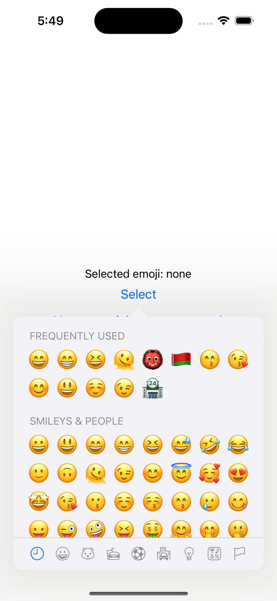

# react-native-mcemoji-picker

An emoji-picker component for iOS, it's a wrapper of the native implmented component [MCEmojiPicker](https://github.com/izyumkin/MCEmojiPicker)

## Installation

```sh
npm install react-native-mcemoji-picker
npx pod-install
```

## Usage

```js
iimport * as React from 'react';
import { useRef, useState } from 'react';
import { StyleSheet, View, Button, Text } from 'react-native';
import { EmojiPicker } from 'react-native-mcemoji-picker';

export default function App() {
  const anchorRef = useRef<any>();
  const [emoji, setEmoji] = useState('none');
  const [isPickerShow, setIsPickerShow] = useState(false);

  return (
    <View style={{ flex: 1, alignItems: 'center', justifyContent: 'center' }}>
      <Text>Selected emoji: {emoji}</Text>
      <Button
        title="Select"
        ref={anchorRef}
        onPress={() => {
          setIsPickerShow(true);
        }}
      />

      <EmojiPicker
        anchorRef={anchorRef}
        show={isPickerShow}
        onSelect={(emoji) => {
          setEmoji(emoji);
        }}
        onClose={() => {
          setIsPickerShow(false);
        }}
      />

    </View>
  );
}
```

## Preview


## License

MIT
